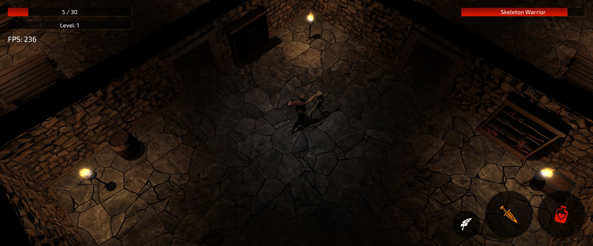

# Dungeon Crawler
Welcome to Dungeon Crawler (working name). A cross platform RPG game written in rust, inspired by classic action RPG's.

Tested platforms:
* Windows
* Linux
* Mac OS (Intel / M1)
* Android

## Roadmap
What's currently implemented and the next steps.

### Implemented
* PBR lighting
* Animations
* Collision detection
* UI
* Basic procedural map generation
* Spacial sound effects
* Ambient sound

### Planned
* Path finding
* Inventory / loot
* World generation
* Quests
* Storyline

## Development

### Compile
#### Desktop
```
cargo run
cargo run --release
```

#### Android

**Setup**
Install Android SDK, NDK and SDK platform

```
export ANDROID_HOME=$HOME/Android/Sdk
export ANDROID_NDK_ROOT=$HOME/Android/Sdk/ndk/<version>
cargo install cargo-apk
rustup target add \
    aarch64-linux-android \
    armv7-linux-androideabi \
    x86_64-linux-android \
    i686-linux-android
```

**Run**
```
cargo apk run -p dungeon-crawler
cargo apk run --release -p dungeon-crawler
```

##### Print logs:
```
adb logcat RustStdoutStderr:D \*:S
```
